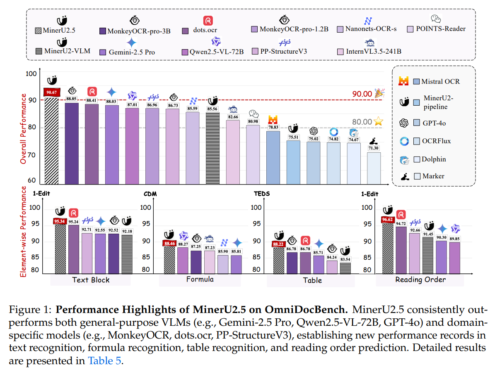
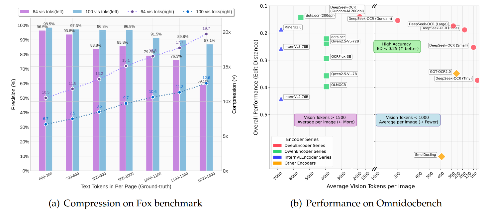

# 主流文档解析方法

## 目录

- [一、引言](#一引言)
  - [1.1 研究背景与目的](#11-研究背景与目的)
  - [1.2 文档解析的重要性及挑战](#12-文档解析的重要性及挑战)
- [二、PDF 解析方法](#二PDF-解析方法)
  - [2.1 MinerU](#21-MinerU)
  - [2.2 DeepSeek-OCR](#22-DeepSeek-OCR)
  - [2.3 olmOCR](#23-olmOCR)
  - [2.4 PaddleOCR-VL](#24-PaddleOCR-VL)
  - [2.5 dots.ocr](#25-dotsocr)
- [三、其他文档格式解析方法](#三其他文档格式解析方法)
  - [3.1 word 解析（docx 格式）](#31-word-解析docx-格式)
  - [3.2 markdown 解析](#32-markdown-解析)
  - [3.3 txt 解析](#33-txt-解析)
  - [3.4 图片解析](#34-图片解析)
  - [3.5 excel 解析](#35-excel-解析)
- [四、总结与展望](#四总结与展望)
  - [4.1 各类文档解析方法总结](#41-各类文档解析方法总结)
  - [4.2 未来发展趋势展望](#42-未来发展趋势展望)

文档解析与加载是离线链路的第一步，其挑战在于处理来源多样、格式各异的文档。一个强大的RAG系统需要能够处理PDF、Word、Excel、Markdown、TXT等常见文件格式，甚至包括图片（通过OCR技术）和音视频文件（通过语音识别技术）。解析过程的核心任务是从这些文件中准确无误地提取出纯文本内容，同时尽可能保留文档的原始结构信息，如标题、段落、列表、表格等。例如，在处理一个PDF报告时，系统不仅要提取文字，还要能识别出章节标题、图表说明等，这些信息对于后续的文本切片和语义理解至关重要。

## 一、引言

### 1.1 研究背景与目的

在数字化信息爆炸的时代，数据的快速增长和多样化使得高效处理和分析文档成为关键挑战。文档解析作为离线链路的第一步，在整个信息处理流程中占据着至关重要的地位。检索增强生成（RAG）系统通过将信息检索与大型语言模型相结合，能够显著提升生成内容的准确性和相关性，已成为当前 AI 领域的重要技术范式。而强大的 RAG 系统需要具备处理 PDF、Word、Excel、Markdown、TXT 等常见文件格式，甚至包括图片（通过 OCR 技术）和音视频文件（通过语音识别技术）的能力。

本报告旨在深入剖析各类文档格式的解析方法，通过对不同解析工具和技术的详细介绍，帮助读者全面了解文档解析领域的现状和发展趋势，为相关研究和应用提供有价值的参考。

### 1.2 文档解析的重要性及挑战

文档解析是将原始非结构化数据转换为结构化或半结构化文本数据的过程，在 RAG 系统中起着举足轻重的作用。其解析质量直接影响着检索效果、生成质量以及系统效率。准确完整的文档解析能够确保相关信息被有效检索，为生成高质量的内容提供可靠依据，同时减少不必要的索引数据量，提升系统运行效率。

然而，文档解析面临着诸多挑战。首先，文档来源广泛且格式各异，每种格式都有其独特的结构和存储方式，这使得统一的解析方法难以实现。例如，PDF 文件以页面描述格式存储文本的视觉布局，缺乏文本属性的元数据；Word 文档则具有丰富的格式和编辑信息。其次，从文档中准确提取纯文本内容并保留原始结构信息并非易事。在处理 PDF 报告时，不仅要提取文字，还要识别章节标题、图表说明等结构信息，这对解析技术的精度和智能性提出了很高要求。此外，对于扫描文档或图像中的文本，还需要借助 OCR 技术进行识别，但 OCR 技术在面对复杂字体、手写文字、低质量图像等情况时，识别准确率会受到影响 。

## 二、PDF 解析方法

### 2.1 MinerU

MinerU 是一款开源的智能文档解析工具，源于 [书生 - 浦语（InternLM）](https://github.com/InternLM/InternLM "书生 - 浦语（InternLM）") 预训练生态，旨在解决 PDF 等非结构化文档的 “结构化转化难题”。它通过双架构解析能力（专家模型组合 + 视觉语言大模型），将 PDF 文档精准转换为 Markdown、JSON 等结构化格式，为大语言模型（LLM）预训练 / 微调提供高质量语料，也可作为 AI 应用（如智能文档问答、文献分析系统）的核心数据预处理模块，尤其在科技文献、多模态文档的处理场景中表现突出。

支持Pipeline 专家模型组合解析和视觉语言大模型（VLM）端到端解析两种解析方式：

- **Pipeline 专家模型组合解析**：通过多个专精模型协同工作，精准解析文档中的文本、图片、表格和公式。适用于对解析精度要求极高的场景，如学术论文和技术手册。
- **视觉语言大模型（VLM）端到端解析**：利用轻量级 VLM 模型实现端到端解析，高效处理大批量文档。适用于需要快速处理的场景，如企业批量文档和通用办公文档。

核心特点：

- **全（多模态 + 多场景覆盖）**：双解析路径均支持文本、图片、表格、公式的全类型提取，适配单栏 / 多栏 / 复杂排版，覆盖学术论文、财务报表、办公文档等 20 余种垂直场景。
- **准（结构化精度高）**：专家路径在公式、表格识别上达到 SOTA 水平，VLM 路径在 5 大公开基准上取得 90.67 综合分，超越 3.7B 的 MonkeyOCR-pro-3B 等模型。

相关资源地址：

- [github](https://github.com/opendatalab/MinerU)
- [huggingface](https://huggingface.co/opendatalab/MinerU2.5-2509-1.2B)
- [MinerU 2.5论文](https://arxiv.org/abs/2509.22186)
- [MinerU 2.0部署教程](./mineru/MinerU%202.0部署.md)，MinerU2.5教程请参考github

### 2.2 DeepSeek-OCR

DeepSeek-OCR 是一个端到端的多模态文档解析模型，是 Vary、GOT-OCR2.0 的后续。其核心目标是用极少的视觉 token 解码出大量文本 token ，通过将文本渲染为图像，通过视觉模型压缩为少量 token，再由语言模型解码还原，形成 “压缩 - 解压” 的完整链路，为大语言模型长上下文处理难题提供了全新解法。不过其 OCR 部分并未开源，若要实现相应功能，需集成插件或借助外部工具。

该模型采用端到端 VLM 架构，由 DeepEncoder 深度编码器与 DeepSeek-3B-MoE 解码器两大核心组件构成。DeepEncoder 是实现高压缩比的关键，参数量约 3.8 亿，专为 “高分辨率输入 + 低 token 输出” 设计。其融合了 SAM 与 CLIP 的优势架构，拥有双特征提取模块，前半部分采用 8000 万参数的 SAM-base，通过窗口注意力机制高效处理局部视觉细节；后半部分采用 3 亿参数的 CLIP-large，以密集全局注意力捕获整体知识信息。中间的 16 倍下采样压缩，在双模块之间加入 2 层卷积模块，将 SAM 输出的 4096 个 patch token 压缩至 256 个，大幅降低全局注意力计算的内存开销。还设计了原生分辨率（Tiny/Small/Base/Large 四种子模式）与动态分辨率（多原生模式组合）两类输入模式，其中 Gundam 模式可通过瓦片化处理超高分辨率图像，输出 token 数为 “n×100+256”（n 为瓦片数量），实现动态分辨率支持 。这种 “局部感知→压缩降维→全局理解” 的设计，既保证了细节识别精度，又将视觉 token 数量控制在极低水平。解码器采用 DeepSeek-3B-MoE 混合专家模型，推理时仅激活 6 个路由专家与 2 个共享专家，实际运行参数量约 5.7 亿 。这种架构实现了 “大模型能力 + 小模型效率” 的平衡，既能精准解析压缩后的视觉特征，又保持了轻量化推理性能，完美匹配编码器的输出处理需求。

DeepSeek-OCR最突出贡献在于其技术创新和性能优化，通过量化压缩分析和新型编码器架构，突破了**高分辨率输入下的低计算激活、高压缩率和少量视觉token输出的难题**，实现了高精度与高压缩率的平衡。但实际应用效果来看，其性能还弱于MinerU等方法。

相关资源地址：

- [github](https://github.com/deepseek-ai/DeepSeek-OCR)
- [huggingface](https://huggingface.co/deepseek-ai/DeepSeek-OCR)
- [论文地址](https://arxiv.org/abs/2510.18234)
- 部署教程参考github，按github步骤，实测有效

### 2.3 olmOCR

\[项目地址]\()

\[论文地址]\()

olmOCR 是 Allenai 开源的一款用于将 PDF 文档高效转换为干净的结构化纯文本的工具。它结合文档锚定（document-anchoring）技术与 Qwen2-VL-7B-Instruct（阿里多模态模型），支持处理多种类型的 PDF 文档，包括学术论文、书籍、表格和图表等 。其通过提取文档中的文本和布局信息，与页面图像结合，能够更准确地提取内容、保留结构化信息。

olmOCR 的创新点主要体现在基于 DOCUMENT-ANCHORING 技术，通过 pypdf 库解析 PDF 结构，提取关键元素的位置信息，动态注入模型提示（Prompt） ，实现元数据提取。同时，其能同时利用 PDF 原生元数据（文本块坐标、图像位置）和页面图像，显著减少模型幻觉，并且对无元数据的扫描文档仍保持高精度，仅依赖图像输入，具有很好的兼容性。在模型架构上，其基于 Qwen2-VL-7B-Instruct 微调，支持 Markdown 结构化输出（公式 LaTeX、表格 Markdown） 。在训练数据方面，构建了 olmOCR-mix-0225 数据集（26 万页 PDF），涵盖学术论文、法律文件、手册等多样化来源。

在实际应用中，olmOCR 具有诸多功能。支持 PDF 文本提取与线性化，将 PDF 文件转换为 Dolma 风格的 JSONL 格式文本，保留阅读顺序；可利用本地 GPU 和 sglang 技术，实现 GPU 加速推理，进行高效文档处理；支持通过 AWS S3 协调多节点任务，实现多节点并行处理，适合处理数百万 PDF；能够处理表格、数学公式和手写文本，实现复杂内容识别，并输出结构化结果；支持本地或云端工作区，存储处理结果和中间数据，实现灵活的工作区管理；提供完整代码和文档，方便二次开发与定制，拥有开源生态支持。实验结果显示，其与教师模型 GPT-4o 的文本对齐度达 87.5%，优于 GPT-4o mini（83.3%） 。在 2,017 份 PDF 的对比测试中，OLMOCR 以 ELO 1800 + 显著优于 Marker、MinerU 等工具 。使用 OLMOCR 数据微调 OLMo-2 模型，在 MMLU、ARC 等基准上平均提升 1.3% 。

### 2.4 PaddleOCR-VL

\[项目地址]\()

\[论文地址]\()

PaddleOCR-VL 是百度于 2025 年 10 月 16 日正式发布并开源的自研多模态文档解析模型。在最新 OmniDocBench V1.5 榜单中，以 92.6 的综合得分位列全球第一，在文档解析的四大核心能力维度（文本、表格、公式、阅读顺序）上，实现全线 SOTA，刷新了全球 OCR VL 模型性能的天花板 。该模型基于 ERNIE-4.5-0.3B 语言模型训练而来，参数量仅为 0.9B，展现了轻量高效的卓越特性。它支持 100 + 种语言文字、手写文字的识别、竖版文字识别、表格中公式识别等多种功能。

PaddleOCR-VL 的核心创新在于其独特的混合式架构，它将轻量而强大的视觉语言识别模型 PaddleOCR-VL-0.9B 与高精度版面分析模型 PP-DocLayoutV2 深度融合。这种两阶段处理流程巧妙地解决了传统端到端 VLM 在处理复杂文档时面临的效率和稳定性问题，实现了性能与可扩展性的完美兼顾。在文档解析的第一阶段，PP-DocLayoutV2 负责执行精细的版面分析，包括对文档中的语义区域进行定位，并预测其正确的阅读顺序。这一阶段的关键在于其解耦设计，避免了大型 VLM 在处理长序列时可能出现的延迟、高内存消耗和 “幻觉” 问题，尤其在多栏或图文混排布局中表现更稳定。PP-DocLayoutV2 主要由基于 RT-DETR 的目标检测模型和轻量级指针网络组成。基于 RT-DETR 的目标检测模型负责精确地检测并分类文档中的各种元素，如文本块、表格、公式、图表、图片、页眉页脚等，并输出它们的边界框位置；轻量级指针网络在检测到所有元素后，会根据元素的几何位置和语义信息，预测出符合人类阅读习惯的阅读顺序，该网络还融入了几何偏置机制，以显式建模元素间的成对几何关系，并通过确定性累积解码算法恢复拓扑一致的阅读顺序。在第二阶段，PaddleOCR-VL-0.9B 基于 PP-DocLayoutV2 生成的版面结构预测结果，进一步完成对多种内容类型的细粒度识别，涵盖文本、表格、数学公式以及图表等。该模型采用了 NaViT 风格的动态高分辨率视觉编码器，支持原生动态分辨率输入，这意味着模型可以处理任意分辨率的图像而无需进行缩放或切片，有效避免了信息损失和失真，极大地增强了对密集文本和低质量图像的识别能力；集成了轻量级的 ERNIE-4.5-0.3B 语言模型，在保持较小参数量的同时，提供了强大的语言理解能力，确保了高效的推理速度；通过双层 MLP 投影器，负责高效地将视觉编码器提取的特征映射到语言模型的嵌入空间，实现视觉与语言信息的无缝融合。

在性能表现上，PaddleOCR-VL 实现了对赛道内所有大小模型的全面超越。在表格结构理解（Table TEDS）方面，得分 93.52，优势明显；表格语义理解（Table TEDS-S）得分 91.43；阅读顺序的误差（0.043）极小 ；公式识别（Formula CDM）为 89.76。在实际场景测试中，无论是打印表格的照片、花体艺术字英文、特殊竖排英文还是餐厅招牌等复杂场景，PaddleOCR-VL 都展现出了极强的鲁棒性和精准的识别能力 。其还能将条形图、折线图、饼图等可视化图表直接转换为机器可读的结构化表格 ，在单张 A100 GPU 上，每秒可处理 1881 个 Token，推理速度较 MinerU2.5 提升 14.2%，较 dots.ocr 提升 253.01%，即使在普通 RTX 3090 显卡上，单页 A4 文档处理也仅需 0.3 秒，满足产业场景 “高并发、快响应” 的需求 。

### 2.5 dots.ocr

\[项目地址]\()

\[论文地址]\()

dots.ocr 是小红书 hi lab 开源的一款功能强大、支持多语言的文档解析模型，它在单一的视觉语言模型中统一了布局检测和内容识别，同时能保持良好的阅读顺序。尽管其基础模型是一个 17 亿参数的 “小模型”，但它依然实现了业界领先（SOTA）的性能，对多语言识别的良好性能弥补了开源社区的空白，其检测、识别能力也为多模态和大模型社区提供了宝贵的基础。

该模型具有诸多优势，在轻量高效方面，基于仅 1.7B 参数的语言模型构建，相较于许多依赖更大模型的文档解析工具，其推理速度更快，处理单页 PDF 仅需数秒即可完成。尽管模型规模较小，dots.ocr 在文本、表格和阅读顺序的解析上表现优异，达到了业界领先水平，其公式识别能力甚至可与 Doubao-1.5 和 gemini2.5-pro 等大型模型相媲美。在多语言支持上，dots.ocr 在多语言文档解析方面表现出色，尤其在低资源语言的处理上展现了显著优势。模型支持包括中文、英文在内的 100 种语言，能够准确识别多语言文档中的文本内容和布局元素，无论是处理多语言混合文档，还是应对复杂语言环境，都能提供稳定的解析效果，为全球化应用场景提供了强有力的支持。在精准布局检测上，dots.ocr 能够准确识别文档中的标题、段落、图片、表格等多种布局元素，并精确标注其位置和类别。得益于其统一的视觉 - 语言架构，dots.ocr 避免了传统多模型流水线带来的复杂性，简化了处理流程，同时保持了良好的阅读顺序，确保解析结果符合文档的逻辑结构。在表格与公式解析方面，dots.ocr 在表格和公式解析上的表现尤为亮眼。模型能够精准检测表格的边界、单元格位置及内容，提取结果高度准确，适合处理结构化数据需求较高的场景。在公式识别方面，dots.ocr 不仅能够处理复杂的数学公式，还能保留原始布局并输出为 LaTeX 格式，极大方便了学术研究和专业文档处理。

dots.ocr 的训练过程分为预训练和监督微调（SFT）阶段。预训练通过三阶段进行，首先基于规模庞大且内容丰富的图文对数据集，从零开始训练 12 亿参数的视觉编码器；然后采用 NaViT 动态分辨率架构支持高达 1100 万像素的高分辨率输入，加入 OCR、视频、定位数据等额外视觉数据，与 Qwen2.5-1.5B 语言模型对齐并训练，产出通用视觉编码器 dots.vit；最后使用纯 OCR 数据集训练，先冻结视觉编码器（VE）参数训练一定量 tokens，再放开全部参数继续训练 1/5 的 token 量，产出 OCR 基座模型 dots.ocr.base 。SFT 阶段采用多样化的 SFT 数据集，构建包含数十万样本的数据集，整合内部人工标注数据、合成数据（表格、公式、多语言 OCR）以及开源数据集；采用迭代式数据飞轮，构建包含 1.5 万样本的内部多语言结构化 layout 数据集，经过三次迭代筛选 “坏样本” 并人工标注后重新加入训练集；采用 “大模型排序 + 规则后验” 的方法修正版面布局数据中元素框的顺序；构建多专家系统用于数据清洗和蒸馏，并应用数据增强（如缩放、旋转、加噪声）来提升模型的鲁棒性；利用单一的结构化布局数据源，构造不同提示词的 SFT 数据，使模型能根据特定提示词执行不同任务 。不过，当前模型在处理高复杂度的表格和公式时尚未完全完善，且对图片内容的解析暂不支持。此外，当文档字符像素比过高或包含连续特殊字符（如省略号或下划线）时，解析可能会出现问题 。

## 三、其他文档格式解析方法

### 3.1 word 解析（docx 格式）

对于 docx 格式的 Word 文档解析，可使用 markitdown 工具。markitdown 是微软开源的多功能文档转换工具，能够将 Word 等多种格式的文件转换为 Markdown 格式。它通过使用不同的解析器读取和解析 Word 文档内容，将文档内容转换为纯文本，并保留结构化信息（如标题、列表等）以适应 Markdown 格式 。通过这种方式，可有效提取 Word 文档中的文本内容，并在一定程度上保留其格式信息，满足对 Word 文档基本的解析需求。例如，在处理包含大量文本、标题和列表的技术文档时，markitdown 能够准确提取文本，并将标题和列表以 Markdown 格式呈现，方便后续处理和分析 。

### 3.2 markdown 解析

Markdown 文档的解析相对简单，可直接读取。Markdown 是一种轻量级标记语言，其语法简洁明了，文件以纯文本形式存储，只需直接读取文件内容即可获取其中的文本信息。这种直接读取的方式简单直接，能快速获取 Markdown 文档中的文本内容，对于一些对格式要求不高，只需要获取文本信息的场景非常适用。例如，在读取 Markdown 格式的博客文章、技术笔记等文档时，直接读取方式能够快速提取其中的文字内容，用于后续的文本分析、检索等操作 。

### 3.3 txt 解析

txt 文件是纯文本文件，直接读取即可获取其中的文本内容。这种方式最为便捷，无需复杂的解析过程。由于 txt 文件不包含任何格式信息，直接读取能够直接获取文件的原始文本，效率高。在许多场景下，如读取日志文件、简单的文本记录文件等，直接读取 txt 文件的方式能够快速满足获取文本信息的需求，无需额外的处理步骤 。

### 3.4 图片解析

图片解析主要借助 OCR（光学字符识别）技术，以及 OCR 与多模态大语言模型（MLLM）相结合的技术。OCR 技术能够将图片中的文字转换为可编辑的文本，其原理是通过对图片中的文字进行特征提取和模式识别，将图像信息转化为字符序列。在处理扫描文档的图片时，OCR 技术可以准确识别其中的文字，将其转换为文本格式，方便后续的编辑和处理 。

而 OCR+MLLM 的结合则进一步提升了图片解析的能力。多模态大语言模型能够理解图像中的文本语义，通过将 OCR 识别出的文本作为输入，结合图像的其他信息，如布局、上下文等，MLLM 可以对文本进行更深入的理解和分析，实现更复杂的任务，如文档理解、图像推理等 。在处理包含图表、公式的图片时，OCR+MLLM 技术不仅可以识别其中的文字，还能理解图表和公式的含义，提供更全面的解析结果 。

### 3.5 excel 解析

对于 excel 文件，可直接读取其中的表格数据。常见的编程语言和数据分析库都提供了读取 excel 文件的功能，如 Python 中的 pandas 库，通过调用相关函数，能够方便地将 excel 文件中的数据读取到数据结构中，进行后续的数据处理和分析 。直接读取 excel 文件的方式能够快速获取表格中的数据，对于需要处理大量表格数据的场景，如数据分析、报表处理等，这种方式能够满足常见的数据提取需求，方便进行数据的统计、分析和可视化展示 。

## 四、各类文档解析方法总结

不同格式的文档解析方法各具特点，适用于不同的场景。在 PDF 解析方面，MinerU 功能全面，在多语言支持、复杂布局处理、内容提取等方面表现出色，适用于对文档结构和内容完整性要求较高的场景，如学术研究、专业文档处理等 ；DeepSeek-OCR 在处理高分辨率图像和复杂视觉元素结构化处理上优势明显，适合处理包含大量图表、公式等复杂元素的文档，如科研报告、技术图纸等 ；olmOCR 在结合文档锚定技术与多模态模型方面有独特优势，能有效减少模型幻觉，适用于对解析准确性和稳定性要求较高的场景，如法律文档、金融报告等 ；PaddleOCR-VL 在综合性能上表现卓越，在文本、表格、公式、阅读顺序等多维度解析能力出色，且推理速度快，适用于对解析精度和效率都有较高要求的产业场景，如企业文档处理、办公自动化等 ；dots.ocr 轻量高效，在多语言识别和表格、公式解析上表现突出，适用于对模型大小和推理速度有要求，且需要处理多语言文档的场景，如全球化业务中的文档处理 。

对于 Word 文档（docx 格式），markitdown 工具能够将其转换为 Markdown 格式，保留一定的结构信息，方便进行后续的文本处理和分析，适用于对 Word 文档进行格式转换和简单内容提取的场景 。Markdown 文档和 txt 文档直接读取即可获取文本内容，简单高效，适用于对格式要求不高，仅需获取文本信息的场景，如简单的文本记录、日志分析等 。图片解析通过 OCR 技术以及 OCR+MLLM 技术，能够将图片中的文字转换为可编辑文本，并实现更深入的语义理解，适用于处理扫描文档、图片中的文字信息提取等场景 。Excel 文件可直接读取表格数据，方便进行数据分析和处理，适用于财务报表处理、数据统计分析等场景 。

在实际应用中，需根据具体需求和文档特点选择合适的解析方法。例如，对于一份包含多语言和复杂图表的学术 PDF 文档，可优先考虑 MinerU 或 DeepSeek-OCR；对于简单的 Word 报告，markitdown 即可满足基本的解析需求；对于大量的图片文字识别任务，OCR 或 OCR+MLLM 技术更为适用 。
